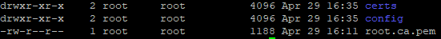

## Statistics Docker Hub

[](https://hub.docker.com/r/wagoautomation/azure-iot-edge)
[](https://hub.docker.com/r/wagoautomation/azure-iot-edge)
[](https://dev.azure.com/WagoAutomation/aws-iot-greengrass/_build/latest?definitionId=1&branchName=azure-pipelines)

## Statistics Git Hub

[](https://github.com/WAGO/aws-iot-greengrass/issues)
[](https://github.com/WAGO/aws-iot-greengrass/stargazers)


# How to setup AWS IoT Greengrass on a Wago Device

## Prerequisites for tutorial
- Preinstalled SSH Client (e.g. https://www.putty.org/)
- Wago Device e.g. PFC200 G2 or Wago Touch Panel with minimal Firmware 12
  - Firmware you can find here: https://github.com/WAGO/pfc-firmware
  - Docker IPKG you can find here: https://github.com/WAGO/docker-ipk
- AWS account 
 

 ## Configure AWS IoT Greengrass on AWS IoT
 https://docs.aws.amazon.com/greengrass/latest/developerguide/gg-config.html 

> <span style="color:red;"> Attention: </span> Skip step 8b of the procedure because AWS IoT Greengrass core and its runtime dependencies are already set up in the docker image.
<br> 

At the end of all steps you should have downloaded the security resources for the newly created Greengrasscore device. 
- <your_guid>-setup.tar.gz <br>

This file will be needed in the later steps. 

## WAGO Device Configuration

### Wago Device Login
Start SSH Client e.g. Putty 
 ```bash
login as `root`
password `wago`
 ```
### Check docker installation
```bash
docker info
 ```

### Enable symlink and hardlink protection. 
* To enable the settings only for the current boot:

``` bash
echo 1 > /proc/sys/fs/protected_hardlinks
echo 1 > /proc/sys/fs/protected_symlinks
```

* To enable the settings to persist across restarts:

``` bash
echo '# AWS Greengrass' >> /etc/sysctl.conf
echo 'fs.protected_hardlinks = 1' >> /etc/sysctl.conf
echo 'fs.protected_symlinks = 1' >> /etc/sysctl.conf

sysctl -p
```

### Create a Greengrass working directory

You can create any working directory for Greengrass. (e.g.)

``` bash
mkdir /home/greengrass
cd  /home/greengrass
```

Download the root CA certificate into the Greengrass working directory (for more information see the documentation https://docs.aws.amazon.com/iot/latest/developerguide/managing-device-certs.html).

``` bash
  wget -O root.ca.pem https://www.amazontrust.com/repository/AmazonRootCA1.pem
or
  wget -O root.ca.pem https://www.symantec.com/content/en/us/enterprise/verisign/roots/VeriSign-Class%203-Public-Primary-Certification-Authority-G5.pem
```

Copy file "<your_guid>-setup.tar.gz" to greengrass working directory on your Wago device. (for this you can use WinSCP or any Ftp client) <br> 
Finally decompress file "<your_guid>-setup.tar.gz"

``` bash
tar xvzf guid-setup.tar.gz
```

Afterwards, the working directory should contain following files.
<br>
<div style="text-align">

</div>

## Running AWS IoT Greengrass Docker Container

``` bash
docker run -it \
--init \
--name aws-iot-greengrass \
-v /home/greengrass/certs:/greengrass/certs \
-v /home/greengrass/config:/greengrass/config \
-p 8883:8883 \
wagoautomation/aws-iot-greengrass
```

The output should look like this example:
```
Setting up greengrass daemon
Validating hardlink/softlink protection
Waiting for up to 30s for Daemon to start

Greengrass successfully started with PID: 10
```

### Persist Greengrass Runtime Logs outside the Greengrass Docker Container
You can run the AWS IoT Greengrass Docker container after bind-mounting the ```/greengrass/ggc/var/log``` directory to persist logs even after the container has exited or is removed.
```
docker run --rm --init -it --name aws-iot-greengrass \
--entrypoint /greengrass-entrypoint.sh \
-v /home/greengrass/certs:/greengrass/certs \
-v /home/greengrass/config:/greengrass/config \
-v /home/greengrass/log:/greengrass/ggc/var/log \
-p 8883:8883 \
wagoautomation/aws-iot-greengrass
```

## How to build an docker Greengrass Runtime image

### Build docker Greengrass Runtime image on wago device
- Clone the GitHub Repository.
- Copy the folder "build-context" to Wago device. 
  - (for this you can use WinSCP or any Ftp client) 
- Start SSH Client e.g. Putty  and login.
 ```bash
login as `root`
password `wago`
 ```
- Then change to the directory "build-context".
- Finally execute following docker command. 

```bash
docker build -t "my_greengrass_tag" --build-arg "greengrass_version=1.8.1" .
```

### Build docker azure-iot-edge-runtime image on linux pc
To build ARM images you need QEMU ARM Emulator installed see (https://www.qemu.org/) 
The easiest way to get QEMU is :
```bash
docker run --rm --privileged multiarch/qemu-user-static:register --reset
```
For more information see: https://hub.docker.com/r/multiarch/qemu-user-static/

- Clone the GitHub Repository.
- Open directory "build-context" with linux terminal.
- Finally execute following docker command. 

```bash
docker build -t "my_greengrass_tag" --build-arg "greengrass_version=1.8.1" .
```


### Lambda Runtime Installations
By default, only the Python 2.7 Lambda runtime is installed. The Nodejs-6.10 and Java-1.8.0 Lambda runtimes are commented out in the Dockerfile. If you want to have support for Java or NodeJs Lambda runtimes, just remove the comment signs and build the image. (comment out following lines)  

```
# RUN apk add openjdk8-jre && \
#     ln -s /usr/bin/java /usr/local/bin/java8
# RUN wget https://nodejs.org/dist/v6.10.2/node-v6.10.2-linux-x64.tar.xz && \
#     tar xf node-v6.10.2-linux-x64.tar.xz && \
#     cp node-v6.10.2-linux-x64/bin/node /usr/bin/node && \
#     ln -s /usr/bin/node /usr/bin/nodejs6.10```
```

### Deploy Lambda Functions to the AWS IoT Greengrass Docker Container


You can deploy long-lived Lambda functions to the Greengrass Docker container.

Follow the steps in "Module 3 (Part 1): Lambda Functions on AWS IoT Greengrass" (https://docs.aws.amazon.com/greengrass/latest/developerguide/module3-I.html) to deploy a long-lived Hello-World Lambda function to the container.

## Links

https://docs.aws.amazon.com/de_de/greengrass/latest/developerguide/run-gg-in-docker-container.html
